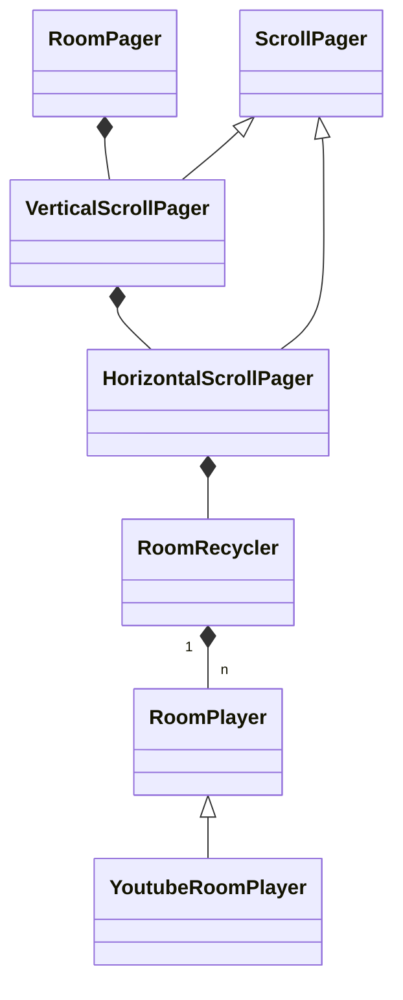

# Android에서 4방향 재활용 가능한 페이징 뷰 만들기 + Youtube WebView 재생
# RoomPager: 양방향 리사이클링 페이저 뷰

# 배경

새롭게 개발중인 서비스인 Diggin’Room은 숏폼 컨텐츠 플랫폼이다. 이를 위해 화면을 꽉 채우는 Video Player (WebView)를 세로로 Paging해야하는 기능이 필요하다. 

추가로, 현재 시청하고 있는 영상에 대해 “싫어요” 기능도 제공하는데, 이는 가로 스와이프 제스쳐로 이루어진다. 

이 두가지 기능을 구현하기 위해 가로와 세로 양 축에서 Paging이 되고, 적은 수의 뷰를 재활용할 수 있도록 Recycling을 제공해야 한다. 

또한 양 축에 대해 이전과 다음 탐색을 할 때 항상 같은 이전, 다음 영상이 표시되도록 보장해야 한다.

> 이 글에서 사용하는 **Room**이라는 용어는 음악 정보를 가지고 있는 동영상을 나타내는 도메인 용어이다.
> 

이 글에서는 RoomPager의 구조와 구현, 문제점과 그 개선에 대해 설명한다.

[전체 코드](https://github.com/woowacourse-teams/2023-diggin-room/tree/android/android/app/src/main/java/com/digginroom/digginroom/feature/room/customview)

# 구조

RoomPager가 VerticalScrollPager, HorizontalScrollPager, RoomRecycler를 가지고 있고 뷰 계층 관계에서 수직적인 구조를 가지고 있다.

또한 RoomRecycler는 RoomPlayer를 n개 가지고 있다.



# RoomPager

> ScrollView, HorizontalScrollView를 가지고 각각의 Scroll Event, Touch Event 발생시 상태를 관리하고 Scroll Position을 결정하고 Recycling하도록 한다.
> 

Android에서는 기본적으로 ScrollView와 HorizontalScrollView가 중첩되면 사용자 터치 입력의 방향에 따라 어떤 ScrollView에 이벤트를 넘겨줄지 결정한다. 

따라서 적절한 ScrollView에 이벤트가 넘겨지고, RoomPager에서는 설정한 Threshold 이상 Scroll했는지 검사하고, `이전, 현재, 다음` 중 하나의 상태를 결정한다.

또한 부드러운 사용자 경험 제공을 위해 현재 보고 있는 Player뿐만 아니라 이전, 다음 Player도 Background에서 미리 Loading시킨다.

```kotlin
// 스크롤 임계 값
val pagingBaseline = (scrollPager.screenSize / PAGE_THRESHOLD)
// 현재 페이지의 최상단 위치 값
val headPosition = scrollPager.scrollPosition * scrollPager.screenSize
// 상태 결정
scrollPager.pagingState = if (scroll < headPosition - pagingBaseline) {
    PagingState.PREVIOUS
} else if (scroll > headPosition + pagingBaseline) {
    PagingState.NEXT
} else {
    PagingState.CURRENT
}
```

Scroll이 멈추고 Touch의 ACTION_UP 이벤트가 발생 했을 때

- 현재 탐색하고 있는 Room의 Index, ScrollPager의 Recycling된 Position등을 결정한다.
    - Room의 Index는 Caching하고 있는 영상의 List에서 적절한 영상을 표시하기 위함
    - Recycling된 Position은 현재 화면에 표시되고 있는 Player에 영상을 표시하기 위함
- RoomPlayer들을 Recycling한다.
- 현재 화면에 표시해야 하는 RoomPlayer에게 SmoothScroll하고 Room을 재생한다.

이때 Recycling하면서 ScrollView의 Position 값이 오차가 발생하므로 이를 보정하는 과정이 필요하다.

### 문제점

ScrollView와 HorizontalScrollView는 FrameLayout을 상속받는다. 따라서 scrollBy, scrollTo 등의 함수들이 호환되지 않는다. 따라서 RoomPager에서 필요한 기능을 추상화해 ScrollPager라는 인터페이스를 만들고, ScrollPager와 각 ScrollView를 상속한 VerticalScrollPager, HorizontalScrollPager를 구현했다. 따라서..

# ScrollPager

> ScrollView의 추상
> 

위와 같이 각 ScrollView에서 쓰일 기능을 추상화하고 아래와 같이 구현하였다.

```kotlin
interface ScrollPager {
    fun smoothScrollTo(position: Int)
    fun scrollBy(position: Int)
    fun scrollTo(position: Int)
    fun post(action: () -> Unit)
    fun setOnScrollChangeListener(listener: (Int) -> Unit)
    fun setOnTouchListener(listener: (MotionEvent) -> Unit)
    fun calculateStartChildPosition(size: Int): Int
    fun calculateEndChildPosition(size: Int): Int
}
```

```kotlin
class HorizontalScrollPager(
    context: Context
) : ScrollPager, HorizontalScrollView(context) {
    override fun smoothScrollTo(position: Int) {
        smoothScrollTo(position, 0)
    }

    override fun scrollBy(position: Int) {
        scrollBy(position, 0)
    }

    override fun scrollTo(position: Int) {
        scrollTo(position, 0)
    }
		...
}
```

이로 인해 RoomPager에서는 ScrollPager 참조만 가지고도 양 스크롤 뷰를 조작할 수 있게 되었다.

# RoomRecycler

> RoomPlayer를 재활용
> 

## 기존 구조

3*3의 GridLayout에서 RoomPlayer 9개를 가지고, Paging 할 때마다 해당 방향으로 한 줄 전체를 떼어 반대 방향으로 이어붙였다.

- 아래 방향으로 탐색 시

| 0 | 1 | 2 |
| --- | --- | --- |
| 3 | 4 | 5 |
| 6 | 7 | 8 |

→

| 3 | 4 | 5 |
| --- | --- | --- |
| 6 | 7 | 8 |
| 0 | 1 | 2 |

## 개선

이전 구조에는 RoomPlayer 9개를 동시에 로딩해야하는 문제가 있었고, 이로 인해 UI Thread의 부하가 심했다. 이를 개선하기 위해 RoomPlayer 3개로 Paging하는 방향에 맞춰 RoomPlayer들의 방향도 조정하고, Recycling도 되도록 하였다.

> 여기서 x는 빈, 화면을 꽉 채우는 크기를 가진 View이다.
> 
- 아래 방향으로 탐색 시

| x | 0 | x |
| --- | --- | --- |
| x | 1 | x |
| x | 2 | x |

→

| x | 1 | x |
| --- | --- | --- |
| x | 2 | x |
| x | 0 | x |
- 현 상태에서 오른 방향으로 탐색

| x | x | x |
| --- | --- | --- |
| 1 | 2 | 0 |
| x | x | x |

→ 축 변경

→ Recycling

| x | x | x |
| --- | --- | --- |
| 2 | 0 | 1 |
| x | x | x |

# RoomPlayer

> 동영상 플레이어의 추상
> 

현재 서비스에서는 Youtube IFrame API를 이용하여 영상을 재생하지만, 향후 HLS 프로토콜을 이용한 영상 플레이어 직접 구현 등 구체는 변경될 가능성이 높으므로 Player에 대한 추상화를 하였다.

```kotlin
interface RoomPlayer {
    fun play()
    fun pause()
    fun navigate(room: RoomModel)
}
```

## YoutubeRoomPlayer

> 서비스에서는 이를 구현한 YoutubeRoomPlayer를 사용한다.
> 

```kotlin
class YoutubeRoomPlayer(
    context: Context,
    private val onYoutubePlay: () -> Unit
) : WebView(context), RoomPlayer
```

### WebView

WebView 위에서 Youtube IFrame API를 이용해 재생한다. 이를 위해 HTML, CSS, JS를 직접 작성하고 WebView에서 Loading한다.

```kotlin
private fun initYoutubePlayer() {
        val iframe = """
            <!DOCTYPE html>
            <html lang="en">
              <script>
                var tag = document.createElement('script');

                tag.src = "https://www.youtube.com/iframe_api";
                var firstScriptTag = document.getElementsByTagName('script')[0];
                firstScriptTag.parentNode.insertBefore(tag, firstScriptTag);
							.....
					"""
```

### Youtube IFrame API

아래는 모두 자바스크립트 소스이다.

- API 로딩

아래와 같이 로딩하지 않으면 동시에 여러 WebView에서 로딩 할 때 간헐적으로 IFrame API 자체를 불러오지 못하는 경우가 발생한다.

```jsx
var tag = document.createElement('script');
tag.src = "https://www.youtube.com/iframe_api";
var firstScriptTag = document.getElementsByTagName('script')[0];
firstScriptTag.parentNode.insertBefore(tag, firstScriptTag);
```

- API 로딩 완료시 콜백
- autoplay, mute 두 변수가 1이어야 영상 로딩시 자동 재생이 가능하다.

```jsx
function onYouTubeIframeAPIReady() {
  player = new YT.Player("player", {
    events: {
      onReady: onPlayerReady,
      onStateChange: onPlayerStateChange,
    },
    videoId: "",
    playerVars: {
      autoplay: 1,
      controls: 0,
      disablekb: 1,
      fs: 0,
      loop: 1,
      modestbranding: 1,
      rel: 0,
      showinfo: 0,
      mute: 1,
      autohide: 1,
    },
  });
}
```

- Player 준비 완료시 콜백

```jsx
function onPlayerReady() {
  Player.onLoaded();
  isPlayerLoaded = true;
}

function onPlayerStateChange(event) {
  if (event.data == 0) player.playVideo();
  if (event.data == 1) Player.onPlay();
}
```

- Player 상태 변경시 콜백

event.data에 들어올 수 있는 값이다.

```jsx
-1(시작되지 않음)
0(종료됨)
1(재생 중)
2(일시중지됨)
3(버퍼링 중)
5(동영상 신호)
```

```jsx
function onPlayerStateChange(event) {
  //영상이 종료되었을 때 루프 설정
  if (event.data == 0) player.playVideo();
	//영상이 재생 중일 때 코틀린 콜백 실행
  if (event.data == 1) Player.onPlay();
}
```

- WebView Javascript에서 Kotlin (Java) 콜백 연결

```kotlin
webView.addJavascriptInterface(
	object {
			@JavascriptInterface
			fun onLoaded() {
				// Do Something
			}
			@JavascriptInterface
			fun onPlay() {
				// Do Something
			}
	},
	// 인터페이스 이름
	"Player"
)
```

- 유튜브 영상 ID 지정

```jsx
function navigate(videoId) {
  if (!isPlayerLoaded) return;
  player.loadVideoById(videoId, 0, "highres");
}
```

### 문제점

(꽤나 많았지만) 크게 2가지가 있었다.

1. CORS(?)
- Youtube에서 저작권 문제로 Origin이 LocalHost이면 재생이 제한되는 영상이 있었다. 이를 위해 프론트 서버에서 IFrame을 띄우고 이를 Android에서 띄우기도 했지만 아래 코드로 Origin을 설정해 해결했다.

> BaseURL (Origin)을 “https://www.youtube.com”으로 설정
> 

```kotlin
loadDataWithBaseURL("https://www.youtube.com", iframe, "text/html", "utf-8", null)
```

1. WebView가 Focus를 잃으면 음성 들리지 않음
- Youtube IFrame에서 재생 준비됨 상태로 변경되면 현재 재생중인 WebView가 Focus를 잃는다.
- 그러면서 현재 재생 중인 WebView의 음성이 들리지 않는 현상이 발생한다.
- 이를 해결하기 위해 Youtube IFrame에서 영상 재생 중 이벤트가 발생하면 RoomRecylcer에서 가지고 있는 모든 RoomPlayer에 대해 현재 시청중인 RoomPlayer를 제외하고 Pause()를 수동으로 직접 실행한다.

# 개선 방안

## 각 컴포넌트간의 계층 관계를 XML로 표현

현재는 RoomPager가 HorizontalScrollView, RoomRecycler등을 직접 Composition하고 인스턴스를 생성하고 있는데, 이렇게 하지 않고 XML에서 표현하게 하도록 할 것이다.

### 장점

1. DataBinding을 이용한 자연스러운 상태, 이벤트 전달 가능
2. XML에서 커스텀 뷰 간의 계층 관계를 명시적으로 확인 가능

# 마치며

이번 프로젝트를 진행하면서 전체 에너지 중 50%는 이 컴포넌트의 구상과 구현에 쏟았다. 

자연스러운 (쇼츠, 릴스 같은) 사용자 경험을 제공하기 위해 수 많은 보정을 가하는 등의 과정이 힘들었지만 내가 상상한 아이디어를 구현함에 있어서 즐거움도 느꼈다.

또한 구현하면서 더 나은 코드를 위한 고민도 많이 했는데, 이 과정에서 추상화, 의존성 역전, 최적화 등에 대해 많이 고민 할 수 있는 경험이었다.