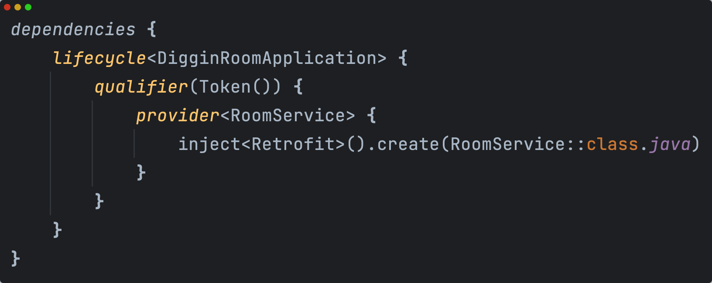
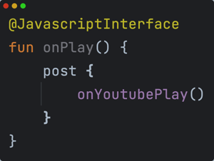
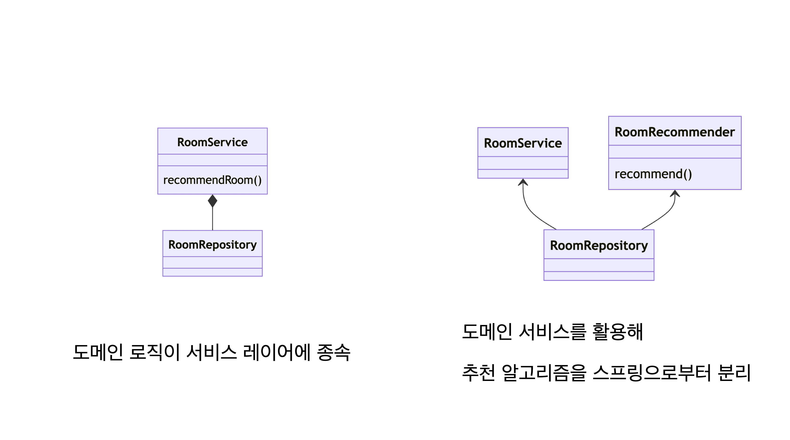

# 김도엽의 포트폴리오

<div class="period">
    <md-block class="markdown-body">
        # 🎵 [Diggin' Room](https://github.com/woowacourse-teams/2023-diggin-room) ([🏪 Play Store](https://play.google.com/store/apps/details?id=com.digginroom.digginroom))
        `Android` `Kotlin` `MVVM` `UI State` `RoomPager`
        ### 사용자 활동을 기반으로 음악을 추천하는 숏폼 컨텐츠 서비스
        ### 🖥️ 기능 
        - 아래로 스와이프하며 끊임없이 새로운 음악을 탐색
            - 장르 기반으로 사용자가 좋아할 수 있는 음악을 예측해서 추천
            - 가중치 기반 추천 알고리즘 직접 구현
        - 마음에 들지 않는 음악은 옆으로 스와이프
            - 해당 음악의 장르 가중치 조절
        - 탐색하며 발견한 음악을 스크랩하여 저장
            - 스크랩한 음악은 유튜브 재생목록으로 추출 가능
        - 음악 메타데이터 제공
        - <video width="157" height="345" controls autoplay loop muted>
            <source src="../articles/images/portfolio/explorer.mov" type="video/mp4">
        </video>
        <video width="157" height="345" controls autoplay loop muted>
            <source src="../articles/images/portfolio/scrap.mov" type="video/mp4">
        </video>
        <video width="157" height="345" controls autoplay loop muted>
            <source src="../articles/images/portfolio/comment.mov" type="video/mp4">
        </video>
        ### 🤙 역할 
        - 초기 아이디어, 앱 전체 흐름을 기획
        - 안드로이드 아키텍쳐 구조, 추천 알고리즘 설계
        ##  구현
        ### Youtube IFrame API를 이용해 영상을 재생하는 YoutubeRoomPlayer 구현
        기존의 기획은 HLS 프로토콜을 이용한 영상을 직접 스트리밍 하려고 하였으나, 유튜브의 음악 데이터를 활용하고 개발 기간을 줄이기 위해 WebView위에서 Youtube 영상을 재생하는 방식으로 구현하였습니다.
        <br>
        **영상 플레이어 인터페이스**
        <br>
        </img>
        <br>
        WebView에서 Youtube IFrame API 제어를 위한 API 로딩, 영상 로딩, 재생, 일시정지등을 JS로 구현했습니다.
        또한 부드러운 사용자 경험을 위해 영상을 캐싱하고 있는데, 영상 로딩 등의 상태에 대해 Kotlin과 인터페이스를 연결해주어 앱 단에서 제어할 수 있도록 하였습니다.
        <br>
        </img>
        <br>
        ### 숏폼 형식 페이저 뷰 [RoomPager](https://github.com/DYGames/RoomPager) 구현
        #### 기존 RecyclerView, ViewPager등으론 숏폼 형태의 페이징 뷰 구현이 불가
        - 뷰 리사이클링, 영상 미리 로딩, 4방향 페이징, 부드러운 페이징을 제공하는 **RoomPager** Custom View 개발
        - Paging 상태에 따라 화면 밖의 YoutubePlayer 조작하여 최적의 숏폼 경험 제공
        ## 🛠️ Troubleshooting
        ### 네트워크 요청, 도메인 로직 등의 수행 결과 로그 확인
        - 기존 코틀린의 Result 클래스를 활용한 LogResult 클래스 구현
        - Success, Failure 상황에서 설정한 채널 (콘솔, Firebase)등에 자동으로 로그 출력
        ### 자동 DI 구현
        기존에는 수동으로 객체 의존 관계를 설정하여 이를 관리하는 클래스가 따로 있었습니다.
        ```kotlin
        class RepositoryProvider(context: Context) {
            private val localDataSourceProvider = LocalDataSourceProvider(context)
            ...
            val roomRepository = DefaultRoomRepository(remoteDataSourceProvider.roomRemoteDataSource)
            ...
        }
        ```
        각 계층의 객체가 많아지고 관계가 복잡해져서 수동으로 관리하기 어려워지는 문제가 발생했습니다.
        Reflection을 이용해 객체 생성자를 검색하고 자동으로 의존을 주입해주는 자동 DI를 개발해 해결했습니다.
        Singleton, Qualifier, Lifecycle등의 기능도 어노테이션을 활용하도록 지원했습니다.
        또한 초기 의존 관계를 DSL로 표현할 수 있도록 하였습니다.
        ### 서버 단의 음악 추천 알고리즘의 서비스 레이어 종속
        음악 추천 알고리즘은 팀 전체가 공유할 수 있는 도메인 레이어에 속합니다.
        기존에 구현상의 편의로 Spring의 Service 클래스 안에 구현되어있었습니다.
        이는 개선 여지가 있다고 생각해 회의를 다수 진행했지만 일정상의 문제로 거절되었습니다.
        결국 직접 도메인 레이어인 Repository 참조를 갖는 도메인 서비스인 RoomRecommender를 구현하였습니다.
        이렇게 백엔드 코드를 수정해 PR을 보내고, 해당 코드를 기반으로 설득하여 프로젝트에 적용되었습니다.
        <br>
        </img>
        # ♻️ [RoomPager (Open Source)](https://github.com/DYGames/RoomPager)
        `Android` `Kotlin` `Custom View`
        ### 안드로이드 4방향 리사이클링 페이저 뷰 | [개발기](https://dygames.github.io/article.html?article=Android%EC%97%90%EC%84%9C%204%EB%B0%A9%ED%96%A5%20%EC%9E%AC%ED%99%9C%EC%9A%A9%20%EA%B0%80%EB%8A%A5%ED%95%9C%20%ED%8E%98%EC%9D%B4%EC%A7%95%20%EB%B7%B0%20%EB%A7%8C%EB%93%A4%EA%B8%B0%20+%20Youtube%20WebView%20%EC%9E%AC%EC%83%9D.md)
        ## 🖥️ 기능 
        - 페이징시 뷰 재사용으로 성능 최적화
        - RecyclerView와 흡사하게 Adapter, ViewHolder 구현으로 사용 가능
        - 4방향 스크롤로 제스쳐 구현 가능
        - Maven Repository에 배포
        ## 🛠️ Troubleshooting
        ### [리팩터링] 양 방향 스크롤 뷰에 대해 중복되는 코드 제거
        Android의 ScrollView, HorizontalScrollView는 FrameLayout을 상속받아 scrollTo()와 같은 메소드를 재사용 불가했습니다.
        <br>
        이를 해결하기 위해 두 스크롤뷰에서 공통적인 특징을 추출하여 ScrollPager라는 인터페이스를 만들어 추상화하였습니다.
        <br>
        그리고 이 인터페이스를 구현하는 VerticalScrollPager, HorizontalScrollPager를 만들어 RoomPager에서 계층 관계를 이루어 사용하게 했습니다.
        <br>
        </img>
        ### [최적화] 뷰 재사용시 위해 9개의 뷰를 동시에 로딩하여 과부하 발생
        기존에 4방향에 대한 부드러운 페이징을 위해 9개 뷰에 영상을 캐싱하며 재활용하였습니다.
        이때 많은 양의 네트워크 요청과 뷰 작업이 일어나 과부하가 발생했습니다.
        이를 해결하기 위해 페이징 방향에 따라 뷰의 위치를 변경하면서 재활용하도록 하였고, 뷰의 개수를 3개까지 줄여 성능을 **3배** 향상 시킬 수 있었습니다.
        # 🪖 장군인사관리체계 재개발
        `Visual Basic` `C#` `Winform`
        ### 군에서 사용되는 대규모 프로그램의 호환성 문제 해결을 위해 재개발
        ## 🤙 수행 내용
        - Visual Basic으로 작성된 코드를 해석하여 C# Winform으로 변환
        - Oracle DB, Excel등 기존 연동 기능도 호환되도록 재개발
        - 실시간 투표 기능을 위해 DB 폴링 구현
        ## 🛠️ Troubleshooting
        ### 문서와 인수자가 존재하지 않는 코드
        - 기존과 정확히 동일한 뷰와 로직 작동이 보장되도록 구현
        - VB을 학습하고, C# Winform에서 비슷하게 동작하는 컴포넌트들을 확인
        - 기존 코드 읽으며 C#으로 재작성하면서, 개선 할 수 있도록 `보이스카우트 법칙` 준수하며 작성
        ### Visual Basic에서 제공하는 문서 프린터 출력 함수가 C#에는 미제공
        - 문서를 프린터에 출력 할 수 있도록 직접 렌더링하는 기능 구현
        - 문서 양식을 지정한 뷰를 생성하고, 이 양식을 뷰와 프린터 양측에 출력하도록 함
        # 🎸 [Tab-share](https://github.com/DYGames/tab-share)
        `React` `JS`
        ### 기타 악보를 웹에서 편집/재생 하는 서비스
        ## 🖥️ 기능
        - .tab 악보 포맷 정의
        ``` 
        127 2 'n' 'n' 2 3 3 1  
        127 3 'x' 'x' 4 5 5 3  
        127 8  
        127 3 'E' 6  
        127 3 'E' 6 'A' 8  
        127 3 'D' 8  
        127 3 'G' 7  
                        ^
        e||-----------x-----------------|----
        B||-----------x-----------------|----
        G||-----2-----4--------------7--|----
        D||-----3-----5-----------8-----|----
        A||-----3-----5--------8--------|----
        E||-----1-----3-----6--6--------|----
        ```
        - HTML5 Canvas를 이용해 해당 악보 포맷을 렌더링, 수정 가능
        - SoundFont를 이용해 여러 음색으로 악보 재생 가능
        <br>
        <iframe width="400" height="225"
            src="https://www.youtube.com/embed/cOPHI_Lp0rA">
        </iframe>
        # 🧒 Doplex
        `Unity` `C#` `Kinect`
        ### 유아용 인터렉티브 미니게임 서비스
        ## 🖥️ 기능
        - 키즈카페, 박람회 등에서 빔 프로젝터로 투사된 영상에 볼풀 공을 던져 진행하는 게임
        - Kinect 센서 값을 이용해 볼 터치를 인식하고 이를 게임과 연결하여 게임 동작
        - 유아가 이용하기 적합한 게임 주제, 난이도, UI 등을 설정하고 여러 미니 게임을 제작
        - 전국 키즈카페에 실제 센서, 게임 설치 후 유지보수
        ## 🛠️ Troubleshooting
        ### 게임 파일의 불법 복제에 대응 불가능
        - 설치 기기의 MAC 주소를 검증하여 실제 구매한 고객만 사용할 수 있도록 하는 인증 시스템 개발
        ### 전국의 게임이 설치되어 있는 곳에 업데이트를 제공
        - 자동 패치 시스템 구현
        - 새로운 버전 출시시 최초 실행시 자동으로 업데이트하도록 구현
        # 🫐 [LotisBerry](https://github.com/DYGames/LotisBerry)
        `Unity` `C#` `3D` `Post-Processing`
        ## 과일 나무를 지키는 3D 타워 디펜스 게임
        # 🖥️ 기능
        - Tile 구조로 맵 상에 타워를 배치
        - NavMesh를 이용해 적의 이동 경로, 타겟 우선순위 결정
        - Top-View, Quarter-View 시점 전환
        - 마우스 포인팅에 따른 플레이어 총구 겨냥 애니메이션 구현
        ## 🛠️ Troubleshooting
        ### 시점 전환시 자연스러운 효과
        - Camera의 ProjectionMatrix를 가져와 행렬에 대한 선형 보간 수행
        - Coroutine을 이용해 보간 값을 Camera에 적용
        ### NavMeshAgent가 목표 타워에 도달하더라도 멈추지 않고 공격을 하지 않는 문제
        - NavMeshAgent의 Stop Distance를 설정하고 일정 거리 이상 도달시 멈추도록 설정
        <iframe width="400" height="225"
            src="https://www.youtube.com/embed/feGyPshVzlU">
        </iframe>
        # 🖥️ [DirectX 2D Game Engine](https://github.com/DYGames/SkillOlympic_Medieval)
        `C++` `2D` `DirectX`
        ## 대회에서 빠르게 게임을 제작 할 수 있도록 제작한 프레임워크
        - Cocos2d-x 엔진을 분석하여 필요한 컴포넌트를 특징하고 구조를 구상
        - Tree 구조의 Game Object 관리
        - 화면 전환을 위한 Scene
        - 2D Sprite Animation
        - 2D Sprite Rendering
        - Input System
        - 2D 물리, 충돌
        # 🍣 [Sushimasen](https://github.com/DYGames/Sushimasen)
        `C++` `2D` `Cocos2d-X`
        ## 초밥 가게를 운영하는 타이쿤 게임
        - 조리, 서빙 두 가지 화면으로 구성
        - 조리 탭에선 손님이 주문한 요리를 조합법에 따라 제작
        - 요리를 많이 제작할수록 조합법이 해금되어 더 많은 수익 창출 가능
        - 빠른 시간 내에 손님에게 서빙하지 않으면 평판 하락
        ## 🛠️ Troubleshooting
        ### 전역에서 관리되어야하는 시간, 금액 등의 데이터 관리
        - Singleton 패턴을 이용하여 필요한 곳에서 접근 가능하도록 구현
    </md-block>
</div>
