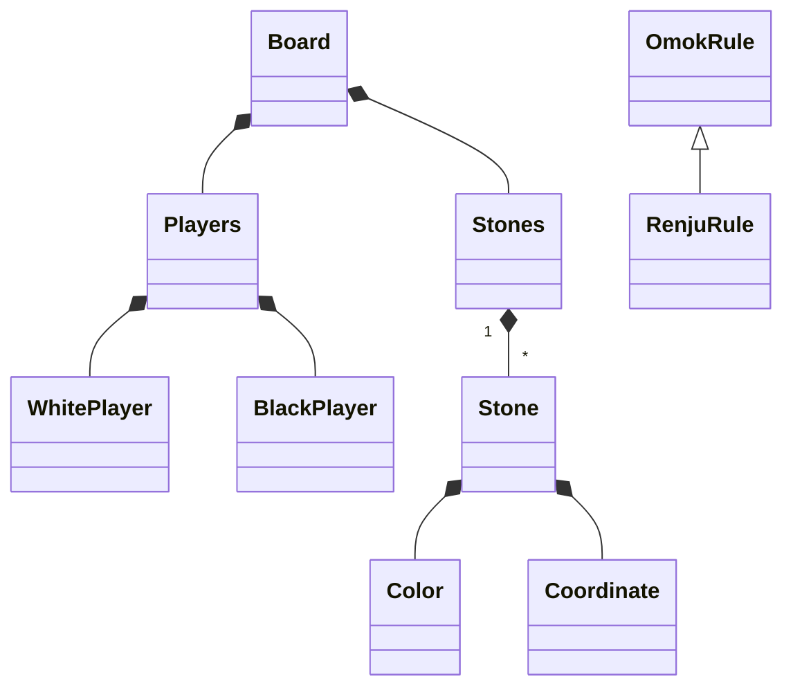
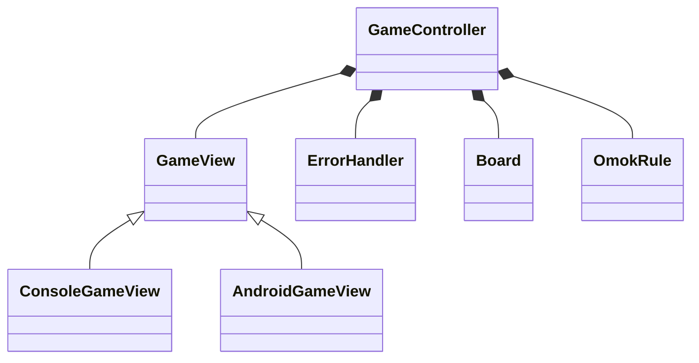
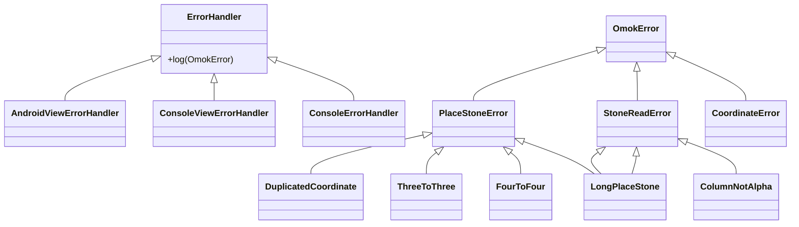
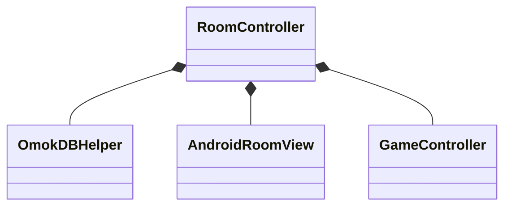

# 오목 미션 회고 및 클래스 구조

레벨 1 마지막 미션으로 오목 미션을 구현하였다.

오목은 콘솔, 안드로이드 두 시스템에서 같은 도메인 코드로 동작하여야 했고, DB에서 진행 중인 게임 내용을 저장하고 불러올 수 있었어야 했다. 추가적으로 렌주룰이 적용되어야 했고 사용자 별로 여러가지 게임을 동시에 진행하고 저장 할 수 있어야 했다.

## 도메인



Board에서 플레이어 간의 turn을 관리하고 승리 여부를 결정한다.

Players에서는 다음 플레이어를 결정한다.

sealed class인 Player는 플레이어의 종류인 WhitePlayer와 BlackPlayer를 정의한다.

Stones에서는 돌을 설치하고 알맞은 위치에 설치된 돌인지, 규칙을 어기진 않았는지 검사한다.

OmokRule은 오목의 규칙을 추상화한다. 

### MVC



Controller가 추상화된 GameView와 도메인 (Board)를 연결한다.

OmokRule은 Controller 단위에서 결정되어 Board에 주입된다.

시스템에 따라 추상화된 GameView를 구현하기만 하도록 설계되어 같은 Controller를 재사용 할 수 있다.

### Error Handler



사용자의 입력에 의해 발생하는 논리 오류는 Exception이 아닌 sealed class로 정의된 클래스를 통해 처리된다.

ErrorHandler를 시스템 별로 처리할 수 있도록 추상화하여 View나 Console, File등으로 에러를 관리 할 수 있다.

## Android SQLite Controller



RoomController가 DB와 View, Domain(Game)을 연결해준다.

AndroidRoomView는 DB와 관련된 View를 관리한다.

### Mapper

```kotlin
interface Mapper<T, R> {
    fun T.toDTO(): R
    fun R.toDomain(): T
}
```

View와 Domain 간에 객체를 분리하고, 변환해주는 역할을 한다.

---

## 회고

### Sealed Class, Interface를 이용한 오류 처리

[논리 오류일 때 예외를 던지지 않고](https://medium.com/@galcyurio/kotlin%EC%97%90%EC%84%9C%EC%9D%98-%EC%98%88%EC%99%B8-%EC%B2%98%EB%A6%AC-%EB%B0%A9%EB%B2%95-48a5cd94a4e6) Sealed Class로 분기 처리 하였다. 이때 Error를 분류하기 위해 Sealed Interface를 사용하였다. 예시를 들면 OmokError를 상속받는 Sealed Interface인 PlaceStoneError를 구현하는 DuplicatedCoordinate object가 있다.

이로 인해 함수에서 PlaceStoneError를 반환하도록 명시하고, 이를 구현하는 클래스만 반환하도록 제한을 줄 수 있다.

### MVC에서 계층 간의 물리적인 분리

Model과 View가 물리적으로 다른 환경에서 실행되고 있다는 가정하에서 구현하여 완전한 분리를 이루었다.

계층간에 데이터 전달은 DTO(Data Transfer Object)와 Mapper로 구현하였고, 각 계층에서 필요한 정도의 유효성 검사를 해 주었다.

- View 단에선 들어온 입력이 유효한 입력인지
- Model 단에선 논리 오류가 발생하지 않는지

### 추상화 (의존성 역전)

의존성 역전 원칙 (DIP: Dependency Inversion Principle)

1. 상위 모듈은 하위 모듈에 의존해서는 안 되고 둘 다 추상화에 의존해야 한다.

2. 추상화는 세부 사항에 의존해서는 안 되고 세부사항(구체적인 구현)은 추상화에 의존해야 한다.

변화할 수 있는 대부분의 요소에 추상화를 적용하여 하위 모듈에 대한 상위 모듈의 종속성을 제거했다.

여러가지 예시가 있지만 대표적으로 GameView를 추상화 한 것으로, GameController에선 추상화된 GameView에만 의존함으로써 Android, Console 두가지 시스템에서 하나의 Controller만 사용해 적용 가능해졌다.

또한 View와 Model에서 사용하는 좌표계를 구별하고, 이를 VectorSystem이라는 인터페이스로 추상화하고 각 계층에서 구현해준 후 Mapper를 이용해 변환해준 예시도 있다.

### 힘들었지만 남은게 많은

하나의 미션에서 요구하는 것도 많았고 욕심이 생겨 이때까지 배운 모든 것을 쏟아부으려 했었다. 하루종일 미션 생각만 하면서 구조적으로 어떻게 개선하면 좋을지, 어떤 방향이 더 적합할지를 고민하면서 적용하고 변경하고 구현하면서 시간을 보냈었다. 위에 적인 내용 뿐만 아니라 SQLite, RecyclerView 등의 안드로이드 요소도 학습하고 적용하는 등 많은 발전을 이루었다고 생각했다.