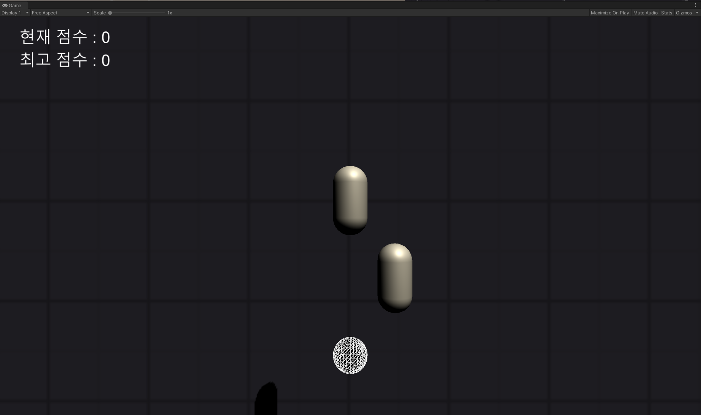
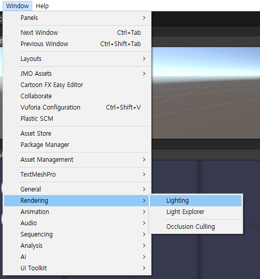
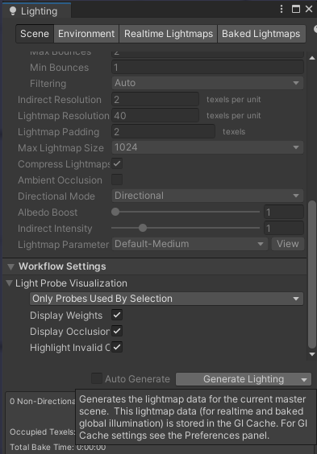
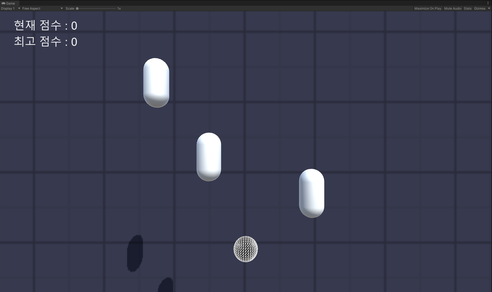

Unity에서 SceneManager.LoadScene() 을 이용해 Scene을 전환 할 시, Scene의 Light가 고장나는 버그가 있다.

이런 경우 Scene의 Light를 Bake해서 문제를 해결 할 수 있다.

Window/Rendering/Lighting

Lighting 창에서 Generate Lighting 버튼을 눌러 Bake한다.

Light가 정상적으로 나타난다.