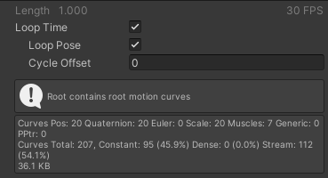
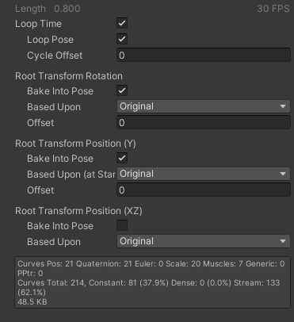
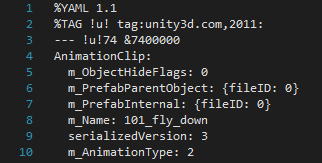
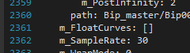
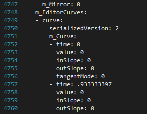

Unity 4.6.8에서 개발된 프로젝트를 2020.3.14f1로 migrate 하던 중, AnimationClip 관련 호환성 문제가 발생했다.

Animation Clip을 Project 탭에서 선택했을때 Inspector탭에서



> Root contains root motion curves

이런 문구가 뜬 것이다.



원래대로라면 이 사진처럼 Root Transform 옵션들이 나와서, Animation 수행 중 Rotation과 Position의 기준을 정할 수 있어야 하는데, 아무 이유 없이 (물론 이유가 없진 않겠지만) 되지 않는 것이다.

[루트 모션 - 작동 방식](https://docs.unity3d.com/kr/current/Manual/RootMotion.html)

원인을 찾으려고 갖가지 노력을 하던 중, Unity 4.6.8과 2020.3.14f1간에 Animation Clip (.anim) 파일의 형식이 조금 다르다는 것을 알아내었다.



먼저 4.6.8에서는 serializedVersion이 3으로 설정되어 있었는데, 2020.3.14에서는 4로 설정되어있었다.



그리고 4.6.8에서는 하단부의 m_FloatCurves 속성이 없거나 비어있었는데, 2020.3.14에서는 채워져 있었다. 



그래서 그 값을 m_EditorCurves 값과 동일하게 채워놓고 다시 Import하니 


옵션이 정상적으로 표시되고 약간 어그러졌던 값들도 정상으로 돌아왔다!

하지만 도대체 이런 일이 왜 발생한건진.. 도저히 모르겠다.

추가로 일일히 이 값들을 바꾸기가 귀찮아 자동으로 바꿔주는 코드를 작성하였다.

한 파일당 10초가 넘게 걸리는 트래쉬 코드이니 사용하실 분들은 최적화를 진행하길 바란다..

```csharp
public class AnimationResolver : MonoBehaviour
{
    [MenuItem("Tools/AnimationResolver")]
    static private void Resolve()
    {
        foreach (UnityEngine.Object o in Selection.objects)
        {
            string pt = AssetDatabase.GetAssetPath(o);
            FileInfo fileInfo = new FileInfo(pt);
            string value = "";
            string target = "";
            bool readtarget = false;

            if (fileInfo.Exists)
            {
                StreamReader reader = new StreamReader(AssetDatabase.GetAssetPath(o));
                while(!reader.EndOfStream)
                {
                    string temp = reader.ReadLine();
                    if (readtarget && temp.Contains("m_EulerEditorCurves: []"))
                        readtarget = false;
                    if (readtarget)
                        target += temp + Environment.NewLine;
                    if (!readtarget && temp.Contains("m_EditorCurves:"))
                        readtarget = true;
                    value += temp + Environment.NewLine;
                }
                reader.Close();
            }

            FileStream fileStream = new FileStream(pt, FileMode.Truncate, FileAccess.Write);
            StreamWriter writer = new StreamWriter(fileStream);

            value = value.Replace("serializedVersion: 3", "serializedVersion: 4");
            if (!value.Contains("m_EditorCurves: []"))
                value = value.Replace("m_FloatCurves: []", "m_FloatCurves: " + Environment.NewLine + target);

            writer.Write(value);
            writer.Close();
        }
    }
}
```

피쓰